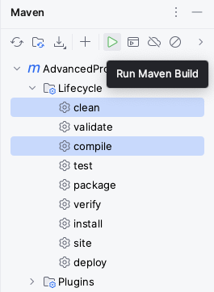
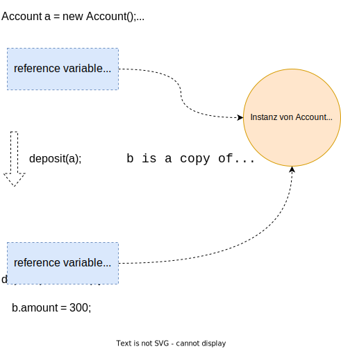
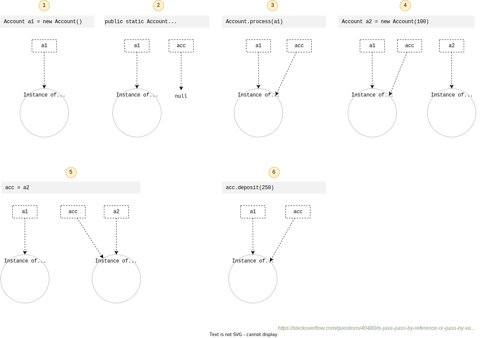

include::../../docs/asciidoc/settings.adoc[]

:toc:

== {course-1}

=== Inhalte

*Setup*:

- [ ] IDE, Tools, Frameworks
- [ ] Test-Driven-Development
- [ ] Build- & Dependency Management
- [ ] Unit-Tests mit JUnit

*Theorie & Objektmodell*:

//tag::content[]
- [ ] Klassen & Objekte
- [ ] Objektvertrag (hashCode, equals)
- [ ] Vererbung & Interfaces
- [ ] Abstrakte Klassen
- [ ] Beziehungsarten (Besitz, Aufruf, Vererbung, ...), Aggregation vs. Komposition etc.
- [ ] Referenzsemantik
//end::content[]

=== Frameworks, Tools & Setup

==== Einrichtung eines lokalen _Workspaces_

TIP: Zuerst wird ein lokaler _Workspace_ eingerichtet, d.h. ein Wurzelverzeichnis, in das das SourceCode-Repository bzw. die Kursinhalte "geklont/gespeichert" werden kann.

_(Natürlich kann man hier immer den persönlichen Präferenzen für dieses Wurzelverzeichnis folgen, für die Einrichtung des Kurses ist es aber besser, den Empfehlungen zu folgen ...)_

Man kann alles Folgende auf unterschiedliche Arten erledigen, vor allem mit dem Unterschied

* Über die GUIs bzw. Menüs der Tools, z.B. bei `IntelliJ` oder
* Über die Kommandozeilen Tools, z.B. `CMD`, `PowerShell` oder die `bash`

_(Ich persönlich richte meine lokale Arbeitsumgebung (den Workspace) wann immer möglich, etwa für ein Projekt, mit exakt der gleichen Struktur wie die des (Online/Remote-) Repositories ein, dazu später mehr)_

Wir verfolgen hier für bestimmte Schritte des Setups die Kommandozeilen Tools, insbesondere für die initiale Nutzung von `git`. Zunächst aber der Workspace:

.Einrichtung Workspace unter *Windows* (11) am Beispiel
[%collapsible]
====
- Terminal (oder auch `CMD` - "Command Line Prompt", könnte PowerShell sein) öffnen (z.B. mit "Suche" nach dem Begriff "Terminal")

- Den aktuellen Pfad im Terminal prüfen

 dir
 => C:\Users\<your-name>

- Hier einen "Workspace" anlegen, d.h. ein Wurzelverzeichnis z.B. "Projekte":

 mkdir Projekte

- Also im Ergebnis:

 C:\Users\<your-name>\Projekte
====

.Einrichtung Workspace unter *MacOS* am Beispiel
[%collapsible]
====
- Terminal öffnen
- Den aktuellen Pfad im Terminal prüfen

 pwd
 => /Users/<your-name>

- Hier einen "Workspace" anlegen, d.h. ein Wurzelverzeichnis z.B. "Projekte":

 mkdir Projekte

- Also im Ergebnis:

 /Users/<your-name>/Projekte
====

==== `Java`

Empfehlung: Im Kurs soll folgende Java Version verwendet werden:

 Java 17 (LTS=Long Term Support)

Ggf. muss diese Version noch installiert werden, wobei die Versionsnummern ("Minor") _hinter_ der Hauptversionsnummer 17 ("Major") nicht so wichtig sind.

- In den neuen Workspace, momentan noch leeren Ordner (s.o.), wechseln

 cd Projekte

- Prüfen, ob `java` vorhanden ist

 java -version

Dann sollte eine Java Version angezeigt werden.

==== IDE `IntelliJ`

*IDE*. Die empfohlene IDE ist `IntelliJ`. Die Seminarinhalte sollten sowohl in der _Community_ als auch in der _Enterprise_ Edition funktionieren.

Der Code für den Kurs wurde mit folgender Version erstellt, die installiert sein muss (falls noch nicht vorhanden, bitte installieren):

 IntelliJ IDEA 2022.3.2 (Community Edition)

TIP: [small]#Alternativ kann auch `MS Visual Studio Code` genutzt werden und diese Umgebung sollte auch bei der Einrichtung keine besonderen Probleme verursachen. Aber ... auf eigene Gefahr ;-), das Seminar wurde (nur) für IntelliJ vorbereitet!#

IntelliJ bietet ein neben dem Standard-Layout auch ein experimentelles, das aktiviert werden kann. Der Standard ist aber vollkommen ok.

[big]#IntelliJ *PlugIns*#

*Bundled PlugIns*::
Mit IntelliJ werden diverse PlugIns automatisch installiert, dazu gehören die folgenden, die für das Seminar erforderlich sind und anfangs mal geprüft werden sollen:

[cols="5a,5e", grid="none", frame="none"]
|===
| PlugIn | Kommentar

| Git & GitHub
| Source Code Management, lokaler Git-Client sollte mind. die Version 2.39.1 haben.

| image::images/maven-plugin.png[]
| Build- & Dependency Management
|===

*Non-bundled PlugIns*::
Für den Code und Tests und die Dokumentation sind folgende PlugIns erforderlich, die nicht sowieso mit IntelliJ installiert werden:

[cols="5a,5e", grid="none", frame="none"]
|===
| PlugIn | Kommentar

| image::images/asciidoc-plugin.png[]
| Dokumentations-Markup, Version 0.38.9 (oder höher)

| image::images/diagrams-net-plugin.png[]
| integrierte Erstellung von Diagrammen, Version 0.1.14 (oder höher)

| image::images/plantuml-plugin.png[]
| Erstellung von UML-Diagrammen, Version 5.22.0 (oder höher)

| image::images/database-plugin.png[width="70%"]
| Zugriff auf H2 Datenbank, Version 3.3.5889.0

|===
[small]#_PS: Ich persönlich aktualisiere sehr zeitnah die PlugIns._#

==== SCM mit `Git` und `Github`

* Bitte zuerst prüfen, ob `git` installiert ist. Das geht am besten im Kommandozeilen Tool durch

 git --version

* was zum Beispiel folgende Ausgabe ergibt: `git version 2.39.1`

* Zunächst muss das Repository (_https://github.com/ThorstenEckstein/dhbw-advanced-programming_) "geklont", d.h. heruntergeladen werden, in Form einer lokalen Kopie:

 git clone https://github.com/ThorstenEckstein/dhbw-advanced-programming.git -b <your-branch>

//Dann bitte direkt auf den Branch `hands-on` durch
// git checkout -b hands-on
// wechseln (kann man natürlich auch in der IDE/IntelliJ machen). In diesem Branch kann, sobald man ihn geklont hat, Code geschrieben werden, aber ...

* Zur Prüfung, auf welchem Branch man sich aktuell befindet, wechselt man in das neue, lokale Verzeichnis des Repositories und gibt ein:

 git branch

* Hier sollte jetzt etwas Ähnliches erscheinen:

   main
   develop
 * <your-branch>

CAUTION: ... es soll kein Code in das `remote` Repository *gepushed* werden, da es sonst zu Konflikten bei möglicherweise erforderlichen Updates (durch _pullen_) kommen kann!

._Hilfe zu bzw. Anzeige von Umgebungsvariablen_
[%collapsible]
====
- *PowerShell*: Umgebungsvariablen prüfen, um alle anzuzeigen

 gci env:

- oder um nur eine einzelne - hier der PATH - anzuzeigen:

 $env:PATH

- *CMD (Command Line Tool)*: Umgebungsvariablen prüfen, um alle anzuzeigen

 set

- oder um nur eine einzelne - hier der PATH - anzuzeigen:

 echo %Path%
====

==== Projekt in `IntelliJ` laden

* IntelliJ starten

* Öffnen des Projektes mit `Open` und das Kurzverzeichnis (Repository) mit auswählen. Das Projekt sollte sich jetzt grundsätzlich "selber" einrichten, z.B. werden erforderliche Bibliotheken im Hintergrund automatisch heruntergeladen, siehe `Maven`, dazu gleich mehr).

* Ggf. stellt IntelliJ dem Nutzer noch Fragen zu bestimmten Aspekten, etwa:

.. Sprache: Soll das `German-Language` Pack downgeloaded werden? => Ja, download
.. Rückfrage zu `Kroki-Settings` (gehört zum Asciidoc PlugIn)? => Ja, download
.. Rückfrage zu `asciidoctorj-diagrams` (ebenfalls im Asciidoc Kontext) => Ja, downlaod
.. evtl. weitere ..., die müssen wir uns dann einfach zusammen anschauen.

Das Projekt sollte jetzt in IntelliJ geladen und verfügbar sein.

==== Projektverwaltung mit `Maven`

Ein sehr weit verbreitetes Framework bzw. Tool ist `Maven`.

Die Erstellung einer Software beinhaltet viele Voraussetzungen, aber noch vor Beginn der Implementierung sollte man sich über ein paar Grundlagen Gedanken machen.

Dazu gehört das *Build- & Dependency Management*. -> https://maven.apache.org/[`Maven`] erleichtert an dieser Stelle u.a. ...

- die Verwaltung von _Dependencies_,
- die Verwaltung des _Classpath_,
- den _Compile_ des Projektes,
- die _Konfiguration_,
- den _Build_ des Projektes und nicht zuletzt
- das _Deployment_ des "Liefergegenstandes" (Deliverable)
- und viele weitere Aspekte ...

Das Tool verfolgt den Ansatz

 Convention over Configuration

was eine geringst mögliche Basiskonfiguration ermöglicht, weil das Tool einfach eine Reihe von Annahmen trifft, die für sehr viele Projekte allgemein anerkannt sind und häufig genutzt werden. Erst wenn von den Konventionen abgewichen werden muss, kann das Projekt entsprechend _konfiguriert_ werden.

Die wichtigste Datei für Maven ist das `Project Object Model` in Form der Datei

 pom.xml

die im Projekt im Wurzelverzeichnis zu finden ist, von vielen IDE automatisch erkannt und beim Laden des Projektes für die Projektkonfiguration genutzt wird.

Bei hierarchischen Projektstrukturen wie in diesem Kurs gibt es mehrere POMs innerhalb der Hierarchie, sogenannte _parent_ und _child_ POMs, die zusammen gehören (-> siehe Kurs Repository)

Das Projekt sollte jetzt einmal insgesamt "gebaut" werden:

* entweder über das User-Interface von IntelliJ
* oder über die Kommandozeile

Am besten einfach in IntelliJ:

* Rechts oben am Rand von IntelliJ gibt es ein Symbol `_m_` (=maven), das öffnet die Standard Maven-View -> *(1)*

* Dann gibt es ein Symbol zur Ausführung von Maven -> *(2)*
* darauf hin öffnet sich ein modales Fenster, hier gibt man `mvn clean compile` in der Kommandozeile ein oder macht das über die GUI -> *(3a)* oder *(3b)*

[cols="1a,1a,1a",grid="none",frame="none"]
|===
^| (1) ^| (2) ^| (3a)
| image::images/maven-view.png[]
| image::images/execute-maven-goal.png[]
| image::images/mvn-clean-compile.png[]
oder *(3b)*

|===

Das Projekt sollte jetzt "bauen", d.h. die Sourcen _kompilieren_ und _assembeln_ (`/target` Ordner, spiel hier aber keine Rolle). Im unteren Bereich von IntelliJ öffnet sich automatisch eine Console und das "Build" Ergebniss wird angezeigt ... hoffentlich [green]#*SUCCESS*# für ale Module ;-) ...

==== Test Driven Development (`TDD`)

Test Driven Development (`TDD`) ist eine gute Praxis, um den Sourcecode von Beginn an - mithilfe von Unit-Tests regelmäßig und bei Änderungen auf Korrektheit zu überprüfen. Die erste Umsetzung erfolgt vielfach durch Testklassen, den `Unit-Tests`.

Unit-Tests haben folgende *Eigenschaften*:

. Unit-Tests sind *automatisiert*. Ein Unit-Test-Framework führt Tests aus, verifiziert und gibt das Ergebnis zurück, damit es geprüft werden kann
. Unit-Tests sind *granular*, sie sollen nur einen kleinen Teil des Codes -häufig eine Methode - testen.
. Unit-Tests *isolieren* das Testziel und sollen möglichst ohne oder nur mit wenig "Vorbereitungen" gestartet werden können
. Unit-Tests sind *deterministisch*, damit das Testergebnis sauber geprüft werden kann und wiederholt werden kann
. Unit-Tests sind *unabhängig*. Die Ausführung der Tests dürfen in keiner Weise von anderen Testmethoden abhängen, denn die Reihenfolge der vom Framework ausgeführten Tests ist zufällig bzw. nicht vorhersagbar.

*Umsetzung*:

Unit-Tests weisen eine besondere (innere) Struktur auf, d.h. die Art und Weise, wie diese geschrieben werden. Dazu zählen

* `given-when-then` oder
* `arrange-act-assert`.

*Vorgehensweise*:

Auch das Schreiben von Tests folgt vielfach einer Routine bzw. einer "best practice". Neben zahlreichen gleichwertigen Ansätzen ist die so-genannte `"red, green, refactor"` Methode weitestgehend anerkannt.

[small]#_Quelle:-> https://www.informatik-aktuell.de/entwicklung/methoden/tdd-erfahrungen-bei-der-einfuehrung.html[Informatik Aktuell]_#

image::images/tdd-red-green-refactor.png[align="center", width="40%"]

*Red, Green, Refactor*:

Der "red, green, refactor" Ansatz hilft Entwicklern, den (zu implementierenden) Code zu entwickeln, indem sie den Fokus in den Phasen auf bestimmte Aspekte lenken:

. [red]#*Red*#: _Was soll implementiert werden und wie fühlt sich das Ganze aus Sicht des "Clients" bzw. der Nutzer an?_ Nutzer sind hier primär die Entwickler selbst bzw. diejenigen, die die Klassen, Methoden, Algorithmen im Code aufrufen, also nutzen wollen. In dieser Phase _soll_ der Test noch scheitern, d.h. "rot" sein, weil hier nicht die Implementierung an sich, sondern die "Außensicht" auf die `API` im Vordergrund steht.

. [green]#*Green*#: In dieser Phase geht es darum, den Test _"zum Laufen"_ zu bringen. Es wird also "grün". Im Vordergrund steht die _schnellste und einfachste Implementierung_ der Funktionalität. Der Code wird hier also nur technisch funktionsfähig gemacht, es werden aber so wenig wie möglich Überlegungen angestellt, wie der Code gut, schön oder effektiv geschrieben werden muss.

. [blue]#*Refactor*#: In dieser letzten Phase (dieser Iteration) geht es nun genau darum, was in den beiden vorherigen Phasen absichtlich nicht gemacht werden sollte, nämlich die Verbesserung des Codes hinsichtlich seiner "Qualität" (das Thema Code-Qualität wird gegen Ende des Seminars noch näher betrachtet). Ergebnis dieser (drei) Phasen soll dann ein Unit-Test sein, der lesbar und wartbar ist und auch die Implementierung der Funktionalität einen bestimmten Reifegrad bzw. eine erste hinreichende Qualität erreicht hat, und natürlich letztlich die korrekte Funktionalität liefert.

Dazu ein *Beispiel*:

 test/de/dhbw/course1/tdd/TddByExampleTest.java

==== `H2` Database

NOTE: In der IntelliJ _Ultimate_ Edition kann das bereits enthaltene PlugIn `Database Tools` genutzt werden, leider aber nicht in der _Community_ Edition. In diesem Fall wird das PlugIn `Database Navigator` genutzt. Dessen Nutzung wird an Kurstag 7 näher erläutert!

Wenn das H2 Database PlugIn korrekt installiert ist, kann man eine Verbindung zu einer H2 Datenbank (Instanz) erstellen.

Das wird im Detail näher in Kurs 7 beschrieben:

-> <<SETUP_H2_DATABASE, Kurstag 7: H2 Database Setup>>

=== Fachlicher Schwerpunkt des Kurses (Fachlichkeit)

==== Kontext

----
Vorbereitung: Darstellung des fachlichen Kontextes

 + Überwachungssystem in der Betriebsleitung

 + Zug, Zugtypen, Triebfahrzeug (Tbf), Wagons
 + Streckennetz

 + Fahrplan

 + Störung, Weichenausfall, Abfahrt, Ankunft (z.B. verspätete Ankunft im Bahnhof)
 + Dispositionsmaßnahme (z.B. Umleitung)
----

Der Zugbetrieb kann grundsätzlich unterteilt werden in:

. *infrastrukturelle* Sicht (_Stammdaten_)
. *planerische* Sicht auf den Betrieb (_Bewegungsdaten, SOLL_)
. *operative* Sicht auf den Betrieb (_Bewegungsdaten, IST_)

Ein paar Begriffe in der Übericht:

image::diagrams/business-model.svg["Fachbegriffe",width="75%",align="center"]

==== Klassenmodell

Die Fachlichkeit (s.o.) kann in einem (Fach-) *Klassenmodell* abgebildet werden, z.B. mit folgenden Objekten:

----
 + Zug (Zugarten), Wagons (Wagonarten)
 + Strecke, Abschnitt, Gleis
 + Ereignisse: Abfahrt, Ankunft
 + Fahrt

 (+ Dispositionsmaßnahme, Umleitung)
----

Überblick über das grundsätzliche *Fachklassenmodell* in zwei "Geschmacksrichtungen":

*Infrastrukturelle* Sicht (statische Sicht):

[plantuml, "Klassenmodell-1", png, align="center"]
....
include::diagrams/business-model-ist.puml[]
....

*Planerische* Sicht (dynamische Sicht):

[plantuml, "Klassenmodell-2", png, align="center"]
....
include::diagrams/business-model-soll.puml[]
....

Für mehr Einblicke in das Modell und die Objekterzeugung, siehe auch

 test/de/dhbw/course1/model/ModelTest.java

=== Das erste Klassenmodell

Die wichtigsten Elemente von Java:

[source,java]
----
- interface
- class
- field
- method
----

Erzeuge ein erstes, kleines *Klassenmodell*:

- Ein Interface `Train` mit mit zugehörigen Methoden für ein Attribut namens `train number`
- Eine Klasse `EuroExpress`, die das Interface `Train` implementiert, also auch das erforderliche Attribut beinhaltet
- Ebenso eine weitere Klasse `Intercity`, die das Interface `Train` implementiert
- Einen Test, der je eine Instanz der zwei Implementierungen erzeugt und deren Zugnummer ausgibt

////
Das Interface `Train` sieht dabei vielleicht so aus:

[source, java, linenums]
----
include::{course-1-src}/model/train/Train.java[lines=5..13]
----
////

=== Objektvertrag (object contract)

In Java erben alle Objekte von der Klasse `Object`, denn ... alle Klassen in Java _sind_ Objekte:

-> https://docs.oracle.com/en/java/javase/17/docs/api/java.base/java/lang/Object.html[https://docs.oracle.com/.../java/lang/Object.html]

Die Klasse stellt den Grundvertrag für alle Java Objekte dar, die folgenden zwei sollen dabei näher betrachtet werden, da sie eine besondere Bedeutung haben:

* `equals()`
* `hashCode()` (_im Debug Modus erkennt man den Hashcode nicht direkt, so etwas wie_ `EuroExpress@1234`)

The Object class defines both the `equals()` and `hashCode()` methods, which means that these two methods are implicitly defined in every Java class, even if they are not implemented explicitly.

The default implementation of `equals()` in the Object class says that *equality* is the same as object *identity*.

[source, java, linenums, title="Gleich oder Identisch?"]
----
include::{course-1-test}/basics/BasicsTest.java[tag="object-contract-1"]
----

[source, java, linenums, title="Gleich oder Identisch?"]
----
include::{course-1-test}/basics/BasicsTest.java[tag="object-contract-2"]
----

=== Reference Semantics

*Example 1*: "_pass by value_"

In the *pass by value* concept, the method is called by passing a value. The argument is a copy of the original one. This is called 'pass by value'. It does not affect the original parameter.

[source, java, linenums, title="Reference Sematics Bsp. mit Primitiven"]
----
include::{course-1-test}/basics/BasicsTest.java[tags="ref-semantics-prim"]
----

image::diagrams/reference-semantics-prim.svg["RefSemPrim",width="50%",align="center"]

*Example 2*: "_pass reference and update its' state_"

Although the argument variable is passed in, the reference itself is copied. The object that is really referenced is still the same and can thus be changed!

[source, java, linenums, title="Reference Semantics Bsp. mit Objekten"]
----
include::{course-1-test}/basics/BasicsTest.java[tags="ref-semantics-obj"]
----

// ---------------------- HIDDEN ----------------------
.Click to reveal details for *Example 3*: "_pass by reference_"
[%collapsible]
====
*Example 3*: "_pass by reference_"

In the *pass by reference* concept, the method is called using an alias or reference of the actual parameter. This is called pass by reference. It forwards the unique identifier of the object to the method. If we make changes to the parameter's instance member, it would affect the original value.

CAUTION: [red]#_Java does not support pass by reference concept!_#

//[subs="normal"]
//----
//include::{course-1-test}/basics/BasicsTest.java[tags="ref-semantics-2"]
//----
====
// ---------------------- HIDDEN ----------------------

Ein weiteres Beispiel für *Reference Semantics*:

[small]#_Quelle: -> https://stackoverflow.com/questions/40480/is-java-pass-by-reference-or-pass-by-value[Stackoverflow]_#

[cols="^1,9a", grid="none", frame="none"]
|===
| # | Erläuterung/Kommentar

| [yellow]#(1)#
| Erzeugung einer Variable `a1` vom Typ `Account` mit Zuweisung zur neuen Instanz sowie der Initialisierung des Attributes `amount` mit dem Wert `0`

[source,java,indent=0]
----
include::{course-1-test}/basics/BasicsTest.java[lines="69"]
----

| [yellow]#(2)#
| Aus Sicht der Methode `process(Account acc)` wird eine Variable `acc` definiert, sie hat initial den Wert `null`

[source,java,indent=0]
----
include::{course-1-src}/basics/refsemantics/Account.java[lines="22"]
----

| [yellow]#(3)#
| Beim Aufruf der Methode `process(a1)` wird der Wert bzw. die "Adresse" der Variable `a1`  nach `acc` kopiert (_"copy-by-value"_)

//include::{course-1-test}/basics/BasicsTest.java[lines="73"]
[source,java,indent=0]
----
        Account.process(a1)
----

| [yellow]#(4)#
| Hier wird (einfach) eine neue Instanz `a2` von `Account` angelegt, sie hat zunächst nichts mit den vorhergehenden Dingen zu tun. Bei dieser zweiten Instanz wird das Attribut `amount` allerdings gleich dem Wert `100` initialisiert

[source,java,indent=0]
----
include::{course-1-src}/basics/refsemantics/Account.java[lines="24"]
----

| [yellow]#(5)#
| Bei der Zuweisung von `acc = a2` wird die Referenz auf die neue Instanz "gelenkt"

[source,java,indent=0]
----
include::{course-1-src}/basics/refsemantics/Account.java[lines="25"]
----

| [yellow]#(6)#
| Hier wird der interne Status der Instanz von `Account`, nämlich der Attributwert von `amount` um `250` erhöht, der Objektzustand wird also verändert!

[source,java,indent=0]
----
include::{course-1-src}/basics/refsemantics/Account.java[lines="27"]
----
|===

=== Übungen

Übungsaufgabe 1::

siehe Kapitel -> "<<_das_erste_klassenmodell,das erste Klassenmodell>>"

Übungsaufgabe 2::
Erzeuge ein zweites Klassenmodell aus dem folgenden Anwendungsfall:

-> _"Ein Bahnhof besteht aus einer Wartehalle und Bahnsteigen mit je mindestens 1 oder 2 Gleisen. Bahnhöfe werden zudem nach Fern- und Regionalbahnhöfen differenziert."_

Übungsaufgabe 3::
Versuche "Reference Semantics" grafisch zu erläutern!

Weitere Übungen::
In der Testklasse finden sich weitere kleine Übungen für die Inhalte des Kurses 1:

[subs=attributes]
 {course-1-exam}/ExamTest.java

