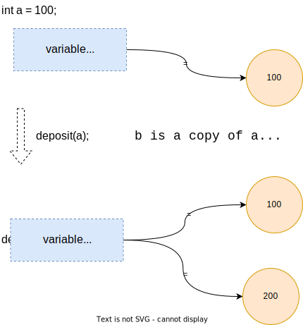
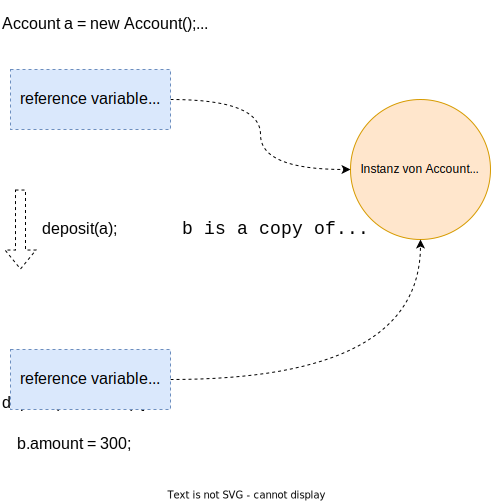
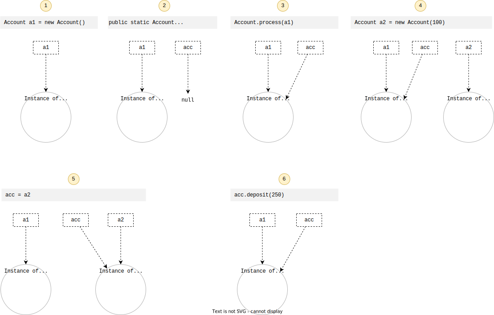

include::../../docs/asciidoc/settings.adoc[]

:toc:

=== Referenzsemantik

==== "_pass by value_"

In the *pass by value* concept, the method is called by passing a value. The argument is a copy of the original one. This is called 'pass by value'. It does not affect the original parameter.

[source, java, linenums, title="Reference Sematics Bsp. mit Primitiven"]
----
include::{course-10-test}/basics/refsemantics/RefSemanticsTest.java[tags="ref-semantics-prim"]
----

==== "_pass reference_"

Although the argument variable is passed in, the reference itself is copied. The object that is really referenced is still the same and can thus be changed!

[source, java, linenums, title="Reference Semantics Bsp. mit Objekten"]
----
include::{course-10-test}/basics/refsemantics/RefSemanticsTest.java[tags="ref-semantics-obj"]
----

// ---------------------- HIDDEN ----------------------
.Click to reveal details for "_pass by reference_"
[%collapsible]
====
"_pass by reference_"

In the *pass by reference* concept, the method is called using an alias or reference of the actual parameter. This is called pass by reference. It forwards the unique identifier of the object to the method. If we make changes to the parameter's instance member, it would affect the original value.

CAUTION: [red]#_Java does not support pass by reference concept!_#

//[subs="normal"]
//----
//include::{course-1-test}/basics/BasicsTest.java[tags="ref-semantics-2"]
//----
====
// ---------------------- HIDDEN ----------------------

Ein weiteres Beispiel für *Reference Semantics*:

[small]#_Quelle: -> https://stackoverflow.com/questions/40480/is-java-pass-by-reference-or-pass-by-value[Stackoverflow]_#

[cols="^1,9a", grid="none", frame="none"]
|===
| # | Erläuterung/Kommentar

| [yellow]#(1)#
| Erzeugung einer Variable `a1` vom Typ `Account` mit Zuweisung zur neuen Instanz sowie der Initialisierung des Attributes `amount` mit dem Wert `0`

[source,java,indent=0]
----
include::{course-10-test}/basics/refsemantics/RefSemanticsTest.java[lines="69"]
----

| [yellow]#(2)#
| Aus Sicht der Methode `process(Account acc)` wird eine Variable `acc` definiert, sie hat initial den Wert `null`

[source,java,indent=0]
----
include::{course-10-src}/basics/refsemantics/Account.java[lines="22"]
----

| [yellow]#(3)#
| Beim Aufruf der Methode `process(a1)` wird der Wert bzw. die "Adresse" der Variable `a1`  nach `acc` kopiert (_"copy-by-value"_)

//include::{course-10-test}/basics/refsemantics/RefSemanticsTest.java[lines="73"]
[source,java,indent=0]
----
        Account.process(a1)
----

| [yellow]#(4)#
| Hier wird (einfach) eine neue Instanz `a2` von `Account` angelegt, sie hat zunächst nichts mit den vorhergehenden Dingen zu tun. Bei dieser zweiten Instanz wird das Attribut `amount` allerdings gleich dem Wert `100` initialisiert

[source,java,indent=0]
----
include::{course-10-src}/basics/refsemantics/Account.java[lines="24"]
----

| [yellow]#(5)#
| Bei der Zuweisung von `acc = a2` wird die Referenz auf die neue Instanz "gelenkt"

[source,java,indent=0]
----
include::{course-10-src}/basics/refsemantics/Account.java[lines="25"]
----

| [yellow]#(6)#
| Hier wird der interne Status der Instanz von `Account`, nämlich der Attributwert von `amount` um `250` erhöht, der Objektzustand wird also verändert!

[source,java,indent=0]
----
include::{course-10-src}/basics/refsemantics/Account.java[lines="27"]
----
|===

=== Übungen

Übungsaufgabe 1::
Versuche "Reference Semantics" grafisch zu erläutern!

