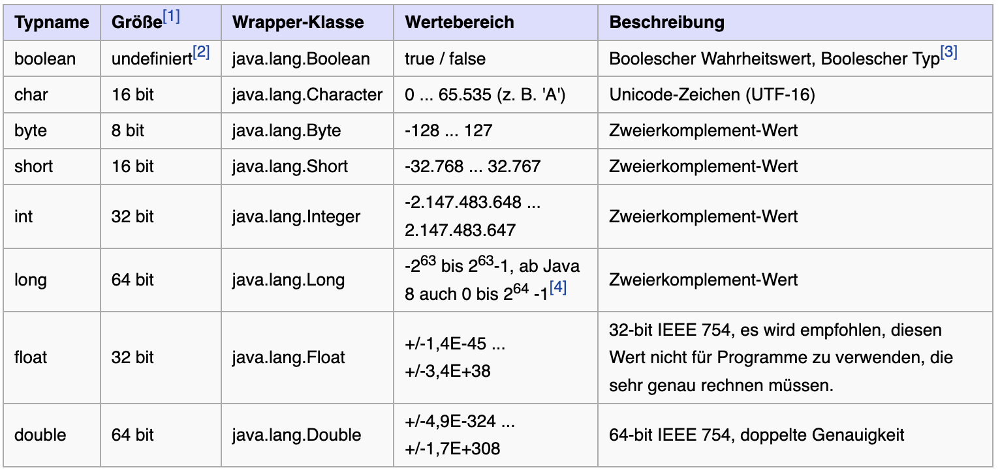
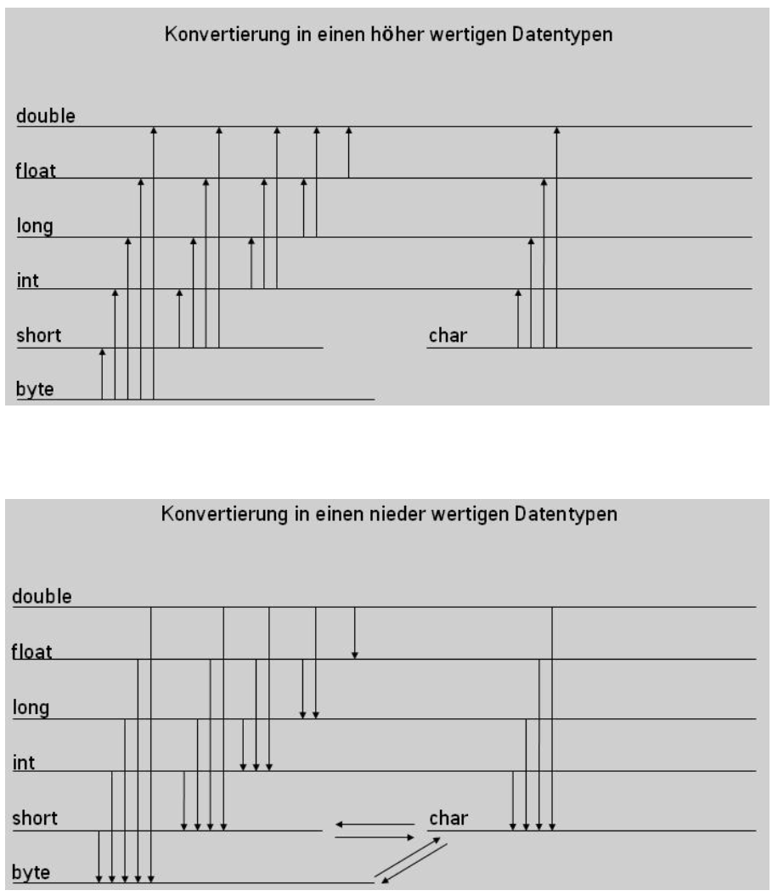

include::../../docs/asciidoc/settings.adoc[]

:toc:

== {course-2}

*Allgemeine Inhalte*

//tag::content[]
* [ ] Methoden überladen, überschreiben/übersteuern
* [ ] Collections API
* [ ] Beziehungsarten (Aufruf, Vererbung, Assoziation, ...)
* [ ] Assoziationen (Aggregation vs. Komposition im Code)
//end::content[]

*Fachlicher Kontext*

Mögliche Assoziationen/Relationen mit Kardinalitäten

----
 + Zug          1:n      Wagon
 + Zug          1:1      Lokomotive
 + Zug          n:m      Soll-Fahrplan
  (=> Zug 1:n Fahrt 1:n Soll-Fahrplan)

 + Zug          n:m      Strecke
 + Zug          1:n      Fahrt
 + Strecke      1:n      Fahrt
  (=> Zug 1:n Fahrt n:1 Strecke)

 + Fahrt        1:n      Reisende
 + Zug          1:2..3   Flügel
 + Streckennetz 1:n      Strecke
 + Strecke      n:m      Abschnitte
----

=== UPDATE

Das *Projekt* bzw. der "_lokale Workspace_", d.h. euer lokales Arbeitsverzeichnis, in dem alle Sourcen liegen, muss als allererstes zum Start in den Tag aktualisiert werden, d.h. ...

-> _"Update Project"_

Das geht am besten mithilfe der IDE im Menü oder über das GIT Icon:

image::images/git-pull.png[width="30%", align="center"]

Danach muss - im sich öffnenden Dialog - noch folgendes bestätigt werden: _merge incoming changes into the current branch_

image::images/git-accept-merge.png[width="50%", align="center"]

Der Vorgang sollte mit einer Erfolgsmeldung abschließen.

=== Recap

Was bisher geschah ...

====
include::../../course-1/docs/course-1.adoc[tags="content"]
====

=== Überladen & Überschreiben

[source,java,title="Beispiel Überladen von Methoden"]
----
include::{course-2-src}/basics/overload/PlatformDisplay.java[lines="5..16"]
----

[plantuml, "overrides", png, float="left"]
....
include::diagrams/override.puml[]
....

[source,java,title="Beispiel Übersteuern von Methoden"]
----
include::{course-2-src}/basics/override/Display.java[lines="2..5"]
----

{nl}
{nl}
{nl}

Die zugehörige Annotation im Code ist

 @Override

Sie sollte in jedem Fall genutzt werden, zudem wird sie auch von der IDE vorgeschlagen

Die zugehörigen *Unit-Tests* finden sich hier:

 /test/de/dhbw/course2/basics/BasicsTest
   .canOverloadMethods()
   .canOverrideMethods1()
   .canOverrideMethods2()

=== Datentypen

Übersicht über die Datentypen in Java:

Quelle: -> https://de.wikibooks.org/wiki/Java_Standard:_Primitive_Datentypen[Wikibooks: Datatypes]

Quelle: -> https://docs.oracle.com/javase/tutorial/java/nutsandbolts/datatypes.html[Oracle: Datatypes]

=== Typumwandlungen

*Type-Casting* mit primitiven Datentypen

Man unterscheidet zwischen einer *expliziten* und einer *impliziten* Typumwandlung.

.Widening & Narrowing

CAUTION: _Bei der Umwandlung in "kleinere" Datentypen können Fehler auftreten (Informationsverlust), es findet das sogenannte "Narrowing" automatisch statt. Es entsteht zwar kein Compiler-Fehler, aber z.B. die Zahl wird verfälscht (-> https://docs.oracle.com/javase/specs/jls/se17/html/jls-5.html#jls-5.1.3[Narrowing])_

==== Implizite Typumwandlung

Die implizite Typumwandlung findet automatisch bei der Zuweisung statt. Dies geht jedoch nur, wenn ein niederwertiger Datentyp in einen höher wertigeren Datentypen umgewandelt wird, also z.B. vom Datentyp `int` in den Datentyp `long`:

[source, java]
----
int wert1 = 10;
long wert2 = 30;
wert2 = wert1; // automatische Umwandlung
----

==== Explizite Typumwandlung

Die explizite Umwandlung erfolgt durch den sogenannten `cast`-Operator mit runden Klammern. Hier wird von einem höher wertigeren Datentyp in einen nieder wertigen Datentypen umgewandelt. In welchen Datentyp umgewandelt werden soll, muss bei dem cast Operator explizit angegeben werden.

[source, java]
----
int wert1 = 10;
float wert2 = 30.5f;
wert1 = (int) wert2; // Umwandlung per 'cast'
----

-> <<Course_2_Exercise_2, Übung 2>>

=== Statische Klassen & Methoden

Das Schlüsselwort `static` bedeutet im Wesentlichen, das die Attribute oder Methoden nicht an die Erzeugung einer *Instanz* gebunden sind.

Siehe dazu den *Unit-Test* hier

 src/test/java/de/dhbw/course2/basics/StaticTest.java

=== Schleifen

Es gibt eine Reihe von Möglichkeiten, über die Einträge von Listen oder Maps zu iterieren. Dazu werden *Schleifen* eingesetzt.

Es drei relevante Schleifen-Typen. Je nach Einsatzszenario entscheidet man sich für eine der drei Schleifen:

* For-(Each)-Schleife
* While-Schleife
* Do-While-Schleife

Hier ein Beispiel für eine häufig genutzte Schleife, die `for-each` Loop:

.siehe -> de.dhbw.course2.basics.BasicsTest.canLoopWithForEach()
[source, java]
----
include::{tests-from-course-2}/de/dhbw/course2/basics/BasicsTest.java[tags="foreach-loop"]
----

=== Collections Framework

Siehe z.B. -> https://en.wikipedia.org/wiki/Java_collections_framework[Java Collections Framework auf Wikipedia]

*Die wichtigsten Auswahlkriterien*:

* Position von Elementen (_numerischer index_)
* Möglichkeit zur Ordnung von Elementen (z.B. _insertion order_)
* Möglichkeit von `null` Elementen oder Duplikaten (_Set vs. List_)

CAUTION: -> _Duplikate in Listen? Wann ist ein Listenelement ein Duplikat? Technisch gleich oder logisch gleich?_

* Zugriff auf Elemente anhand eines Schlüssels (_List vs. Map_)

image::images/collections-api.png["Collections API",width="100%",align="center"]

==== Java Collections API Interfaces

Java collection interfaces are the foundation of the Java Collections Framework. All core collection interfaces are generic.
For example `public interface Collection<E>`. The <E> syntax is for Generics and when we declare Collection (_später mehr zum Thema `Generics`_)

. *Collection interface*.
This is the root of the collection hierarchy. A collection represents a group of objects known as its elements. Some basic operations are provided.

. *Iterator Interface*.
Iterator interface provides methods to iterate over the elements of the Collection. Iterators allow the caller to remove elements from the underlying collection during the iteration.

. *Set Interface*
Set is a collection that cannot contain duplicate elements.
The Java platform contains three general-purpose Set implementations: HashSet, TreeSet, and LinkedHashSet.

. *List Interface*
List is an ordered collection and can contain duplicate elements. You can access any element by its index.
List has a dynamic length. ArrayList and LinkedList are implementation classes of List interface.

. *Queue Interface*
Queue is a collection used to hold multiple elements prior to processing.
Besides basic Collection operations, a Queue provides additional insertion, extraction, and inspection operations.
Queues typically, but do not necessarily, order elements in a FIFO (first-in-first-out) manner.

. *Dequeue Interface*
A linear collection that supports element insertion and removal at both ends. The name deque is short for "double-ended queue"

. *Map Interface*
Java Map is an object that maps keys to values. A map cannot contain duplicate keys, each key can map to at most one value.
The Java platform contains three general-purpose Map implementations: HashMap, TreeMap, and LinkedHashMap.

. *SortedSet Interface*
SortedSet is a Set that maintains its elements in ascending order. Sorted sets are used for naturally ordered sets.

. *SortedMap Interface*
A map that maintains its mappings in ascending key order. This is the Map analog of SortedSet.
Sorted maps are used for naturally ordered collections of key/value pairs.

TIP: Übrigens, das ist eine beliebte Prüfungsfrage: _"Welche Eigenschaften hat das Collections-Interface ...?"_

==== Special Java Collections Classes

Java Collections framework comes with many implementation classes for the interfaces. Most common implementations are:

. `HashSet` Class
. `TreeSet` Class
. `ArrayList` Class
. `LinkedList` Class
. `HashMap` Class
. `TreeMap` Class

==== Synchronized Wrappers

The *synchronization* wrappers add automatic synchronization (thread-safety) to an arbitrary collection.
Each of the six core collection interfaces - Collection, Set, List, Map, SortedSet, and SortedMap - has one static factory method, which return a synchronized (thread-safe) collection backed up by the specified collection.

==== Unmodifiable Wrappers

*Unmodifiable* wrappers take away the ability to modify the collection by intercepting all the operations that would modify the collection
and throwing an UnsupportedOperationException.

Its main usage are;

- To make a collection immutable once it has been built
- To allow certain clients read-only access to data structures (keep a reference to the backing collection but hand out a reference to the wrapper)
- To avoid ConcurrentModificationException

=== Assoziation

==== One-to-One-Assoziation

Siehe Unit-Test:

 de.dhbw.course2.relations.RelationsTest.oneToOne()

Ein Beispiel::
_Jede natürliche Person besitzt (genau) einen Personalausweis, der Ausweis kann verloren gehen, die Person kann sterben, dann müsste auch der Personalausweis vernichtet werden._

Es geht hier also oft um die Überlegung zur *Semantik bzw. Qualität* einer Beziehung zwischen zwei abhängigen Objekten!

==== One-to-Many-Assoziation

Ein Beispiel für eine Eins-zu-Viele Beziehung:

[plantuml, "one-to-many", png, align="center"]
....
include::diagrams/one-to-many-example.puml[]
....

Zugehörige Unit-Tests:

 de.dhbw.course2.relations.RelationsTest.oneToMany1()
 de.dhbw.course2.relations.RelationsTest.oneToMany2()

sowie Implementierungen für V1 und V2:

 de.dhbw.course2.basics.collections.n

==== Many-to-Many-Assoziation

Die folgenden zwei Varianten kommen am häufigsten vor:

[plantuml, "many-to-many", png, align="center"]
....
include::diagrams/many-to-many-example-2.puml[]
....

Implementierungsbeispiele:

 de.dhbw.course2.basics.collections.n
 de.dhbw.course2.basics.collections.nm

Zugehörige Unit-Tests:

 de.dhbw.course2.relations.RelationsTest.manyToMany()

Eine weitere Perspektive auf Relationen kommt oft im Umfeld Datenbanken & SQL vor, dazu mehr erst später, am -> `Kurstag 7`.

=== Übungen

Die *Übungen* sollen in Form von *Unit-Tests* in folgendem _Package_ implementiert werden:

[subs=normal]
 src/[red]#*test*#/java/de/dhbw/course2/exercises/ExerciseTests.java

Die *Testobjekte*, also die _echten_ Klassen, Interfaces oder anderer Sourcecode sollen getrennt, nämlich hier umgesetzt werden:

[subs=normal]
 src/[red]#*main*#/java/de/dhbw/course2/exercises

[[Course_2_Exercise_1]]
Übung 1::

Die Übung für `equals()` und `hashCode()` besteht aus 2 Teilen:

*1a)*
Erstelle eine Klasse `News`, die den Inhalt der News als Attribut/Feld vom Typ `String` enthält. Versuche dabei, die zum Feld gehörenden Methoden (`getter` und `setter`) UND einen Konstruktur (optional) mithilfe von _Code Generierung_ zu erzeugen. Schreibe dazu einen Test (in der Testmethode `exercise1a()`), in der der hashCode von 2 News-Instanzen _technisch_ verglichen wird.

*1b)*
Mache die News mithilfe der Methode `equals()` und `hashCode()` (=Overrides aus der Klasse Object) _logisch_ vergleichbar. Schreibe einen Test (in der Testmethode `exercise1b()`), durch den geprüft werden kann, ob 2 News (= 2 Instanzen der Klasse News) mit verschiedenen - vielleicht aber _ähnlichen_ Aussagen - inhaltlich gleich sind oder nicht.

[[Course_2_Exercise_2]]
Übung 2::

Übung zu *Typumwandlung* in

[subs=normal]
 src/[red]#*test*#/java/de/dhbw/course2/exercises/MoreExerciseTests.java

Schreibe je einen Test für

a. Gegeben `char c = '1'` -> Umwandlung in `int`
b. Gegeben `int i = 127` -> Umwandlung in `byte`

und prüfe das Ergebnis, also den erwarteten Wert, jeweils mithilfe der Assertions-Methode `assertEquals(<expected>, <actual>)`.

[[Course_2_Exercise_3]]
Übung 3::

Übung zu *Syntax, Klassenmodell* und erforderliche *Methoden*.

Erzeuge eine

. konkrete Klasse `Person`
. mit einem Attribut `name`, erstelle dann
. die zum Attribut gehörende `get` und `set` Methode,
. erstelle außerdem die `equals()` und `hashCode()` Methoden,
. zuletzt leite aus dieser konkreten Klasse ein Interface `Mensch` ab

Wenn möglich, nutze für alle diese Schritte `Code-Generation`, die von der IDE angeboten werden (IntelliJ, Tastenkombinationen).

[[Course_2_Exercise_4]]
Übung 4::

a. *Listen*: Schreibe einen Test, in dem eine konkrete Implementierung von `List` und den Datentyp `Integer` benutzt wird. Befülle diese mit beliebig vielen Einträgen. _Optional: ... und summiere alle Listeneinträge mithilfe einer `for-each` Schleife_.

b. *Maps*: Schreibe einen Test, in dem eine konkrete Implementierung von `SortedMap` benutzt wird. Befülle diese mit mindestens 5 Einträgen, nutze dazu `String` sowohl für den Schlüssel (K) also auch für den Wert (V). Überprüfe die Haupt-Charakteristik _"natürliche Sortierung"_ dieses Map-Typs.

[[Course_2_Exercise_5]]
Übung 5 (optional)::

Umsetzung des Prinzips *Information Hiding*:

In dem folgenden Paket finden sich die Klassen aus der Demonstration:

 de.dhbw.course2.basics.collections.nm.v2

Diese Klassen enthalten aber noch keine Methoden!

Füge die zu den Attributen gehörenden `getter` und `setter` Methoden hinzu und passe auch den zugehörigen Unit-Test entsprechend an. Der findet sich hier:

 de.dhbw.course2.relations.RelationsTest.manyToMany()

Testfragen::
Im Modul `/exam` finden sich weitere kleine Übungen für die Inhalte des Kurses 2, und zwar in der dortigen Testklasse:

[subs=attributes]
 {course-2-exam}/ExamTest.java

