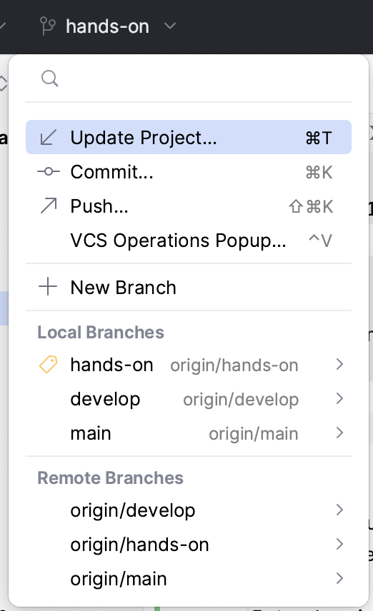
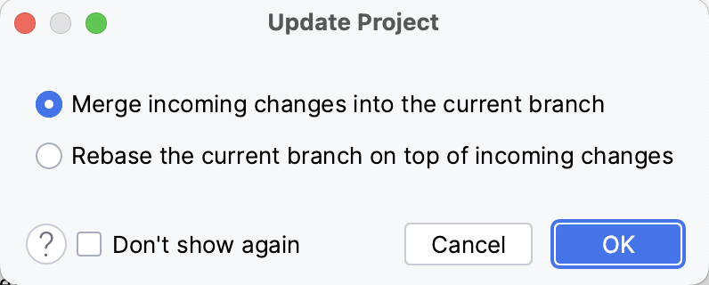

include::../../docs/asciidoc/settings.adoc[]

:toc:

== {course-3}

*Allgemeine Inhalte*

//tag::content[]
* [ ] Generics
* [ ] Streaming API
* [ ] Funktionale Programmierung mit Lambda-Ausdrücken
//end::content[]

*Fachlicher Kontext*
----
 + eher Theorie
 + Standard-Beispiele/-Übungsaufgaben
----

=== UPDATE

Das *Projekt* bzw. der "_lokale Workspace_", d.h. euer lokales Arbeitsverzeichnis, in dem alle Sourcen liegen, muss als allererstes zum Start in den Tag aktualisiert werden, d.h. ...

-> _"Update Project"_

Das geht am besten mithilfe der IDE im Menü oder über das GIT Icon:

Danach muss - im sich öffnenden Dialog - noch folgendes bestätigt werden: _merge incoming changes into the current branch_

Der Vorgang sollte mit einer Erfolgsmeldung abschließen.

=== Recap

Was bisher geschah ...

====
include::../../course-2/docs/course-2.adoc[tags="content"]
====

=== Generics

Generische Programmierung in Java ist durch Generics seit langem möglich. Der Begriff steht synonym für "parametrisierte Typen". Die Idee ist, zusätzliche Variablen für Typen einzuführen. Diese Typ-Variablen repräsentieren zum Zeitpunkt der Implementierung unbekannte Typen. Erst bei der Verwendung der Klassen, Schnittstellen und Methoden werden diese Typ-Variablen durch konkrete Typen ersetzt. Damit kann typsichere Programmierung meistens gewährleistet werden. In der Regel wird die Codemenge durch Generics reduziert (Prinzip: `DRY`), manchmal wird er allerdings auch schwerer wartbar und abnehmende Lesbarkeit. Die folgenden zwei Varianten finden sich in der Praxis am häufigsten:

* Java Generics `Klasse`
* Java Generics `Methode`

TIP: [small]#_Viele Beispiele finden sich auch im Collections Framework, etwa die  Interfaces `List<T>` oder `Map<K,V>`. Siehe dazu z.B. -> https://docs.oracle.com/en/java/javase/17/docs/api/java.base/java/util/package-summary.html[Java 17 Package Documentation für `java.util`]!_#

[source,java,lines,title="Beispiel einer generischen Klasse"]
----
include::{course-3-src}/generics/Joiner.java[tag="generic-class"]
----

Zeile 1 macht die Klasse generisch, in Zeile 9 wird der unbekannte Typ genutzt.

[source,java,title="Beispiel einer generischen Methode"]
----
include::{course-3-src}/generics/Printer.java[tag="generic-method"]
----

*Bounded Generics*

Oft kommen sogenannte *bounded generics* zum Einsatz.
Dabei wird bei der Definition einfach die Superklasse angegeben, von welcher der generische Typ erben muss. Auf diese Weise wird der ansonsten _beliebige_ Typ eingeschränkt, so dass der generische Typ zwar immer noch unbekannt ist, aber nicht von _jedem_ Typ sein kann, sondern nur entsprechend der Einschränkung, z.B.

[source, java]
----
 public <T extends Number> add(T first, T second) { ... }
----

=== Funktionale Programmierung mit Lambda Ausdrücken

Funktionale Programmierung ist ein *Programmierparadigma*, in dem Funktionen im Mittelpunkt stehen, sie werden nicht nur definiert und angewendet, sondern auch wie Daten miteinander verknüpft, als Parameter verwendet und als Funktionsergebnisse genutzt.

Seit Java 8 sind Elemente aus der funktionalen Programmierung in der Sprache enthalten. Ermöglicht werden sie durch die *Lambda-Ausdrücke*, sowie - wie bereits gesehen - die Streams.

Die einfachste Form eines Lambda Ausdruckes ist:

 parameter -> expression

Um mehr als einen Parameter zu nutzen, werden runde Klammern erforderlich:

 (parameter1, parameter2) -> expression

Weil die Ausdrücke limitiert sind und direkt einen Wert zurückgeben, kann auch ein Code-Block genutzt werden:

 (parameter1, parameter2) -> { code block }

Zu beachten ist, dass der `{ code block }` ein return statement enthalten muss.

Die Beispiele finden sich in

 course-3/test/de/dhbw/course3/lambda/LambdaTest.java

z.B. für den Gebrauch in *Listen*:

[source,java,title="Lamdba Ausdrücke"]
----
include::{course-3-test}/lambda/LambdaTest.java[tag="lambda-example-1"]
----

=== Streaming (API)

Zur verbesserten Verarbeitung von "Listen" in Java wurden spezielle Methoden durch "streaming" mit Java 8 eingeführt. Häufig wird der Begriff `filter-map-reduce` genutzt, um diese Möglichkeiten zusammenzufassen.

`Filter`

Bei der Anwendung mehrerer oder komplexer Filteroperationen sollte die Performanz beachtet werden. Hier eine Einschätzung:

.Performanz bei komplexen Filteroperationen
image::images/FilterPerformance.png[width="100%",align="center"]

`Map`

_"Mapping"_ Operationen auf Listen transformieren diese. Methoden oder Klassen, deren Zweck die Abbildung von Klassen in andere Strukturen implementieren, werden häufig _"mapping"_ Methoden genannt, daher hier dieser Term hier ebenfalls genutzt.

Besonders die Veränderung der Datentypen der Listenelemente ist ein wichtiger Anwendungsfall beim Einsatz von `map(...)`.

`Reduce`

`Stream.reduce()` Operation reduzieren die Ausgangsdatenmenge. Dies erfolgt in Teilschritten:

* `Identity` – Ein Element mit einem initialen Wert für die Reduktionsoperation und der "default return value" wenn der Stream leer sein sollte.
* `Accumulator` – Eine Funktion mit zwei Parametern: ein Teilergebnis der Reduktionsoperation und das nächste Element des Streams.
* `Combiner` – Eine Funktion um die Teilergebnisse (der Reduktionsoperation) zu kombinieren wenn `reduce` parallelisiert wird.

Richtig nutzbringend ist oft erst die Kombination `filter`, `map` und `reduce` Operationen, um aus einfachen *Daten* am Ende *Informationen* zu gewinnen.

Dazu ein Beispiel:

[source,java,title="Beispiel einer reduce() Operation"]
----
include::{course-3-test}/streaming/StreamingTest.java[tag="reduce-example1"]
----

Weitere Beispiele finden sich in

 course-3/test/de/dhbw/course3/streaming/StreamingTest.java

sowie zur Demonstration für einen *fachlichen* Nutzen, der "Erkenntnisse" aus den vorhandenen Daten ermittelt:

[source,java,title="Fachliches Beispiel (good code?, bad code?)"]
----
include::{course-3-test}/lambda/LambdaTest.java[tag="lambda-example-2"]
----

=== Übungen

Wie immer, nutze einfach die Testklasse für die Übungen, hier unter `/course 3`:

 /src/test/de/dhbw/course3/exercises/ExerciseTests.java

Übung 1::

Implementiere eine Klasse `Workflow` mit einer statischen & generischen Methode `execute`, die beliebige Workflow-Schritte ausführen kann. Konkrete Workflowschritte erben von einer Klasse namens `Step`. Die "Ausführung" selbst soll hier lediglich die Ausgabe des Names des Workflow-Schrittes sein (der Klassenname)

Übung 2::
Implementiere den _"old fashioned way"_ für die Berechnung einer Summe:

[source, java]
----
include::{tests-from-course-3}/de/dhbw/course3/exercises/ExerciseTests.java[tags="old-fashioned-reduce"]
----

Übung 3::
Für einen `Warenkorb` gilt es, deren enthaltene `Produkte` zu filtern und den gesamten `Preis` zu ermitteln:

Übungsfragen::
In der nachstehenden Testklasse finden sich kleine "Quizfragen" für die Inhalte des Kurses 3:

[subs=attributes]
 {course-3-exam}/ExamTest.java

=== Tipps, Patterns & Best Practices

*Predicates*

`Predicates` sollten, wenn möglich, _benannt_ werden, d.h. zum Beispiel anstelle von

 list.stream().filter(i -> i >= 10)

besser gekapselt in einer Methode oder mit einer Variable

 Predicate<Integer> isGreaterOrEqual10 = i -> i >= 10

oder

[source, java]
----
Predicate<Integer> isGreaterOrEqualTo(Integer number) {
   return i -> i >= number;
}
----
