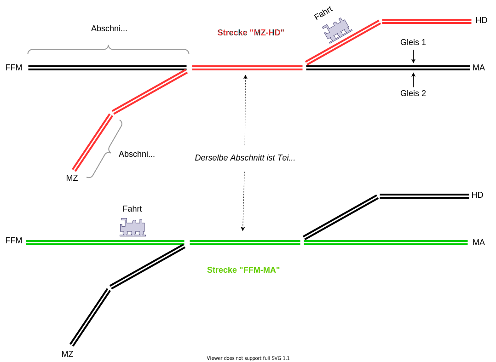

include::settings.adoc[]

== {course-1}

*Allgemeine Inhalte*

_Setup_:

* IDE (IntelliJ & Visual Studio Code), Java (Installation, etc. ...)
* Test-Driven-Development
* Unit-Tests mit JUnit

_Objektmodell_:

* Objekte & Klassen
* Vererbung & Interfaces, Assoziationen
* Abstrakte Klassen
* Objektvertrag (hashCode, equals)
* Methoden überladen, überschreiben
* Sichtbarkeiten, Modifiziere

*Fachlicher Kontext*
----
Vorbereitung: Darstellung des fachlichen Kontextes

 + Überwachungssystem in der Betriebsleitung
 + Zug, Triebfahrzeug (Tbf), Wagons (Spezialisierung Flügelzug)
 + Streckennetz
 + Störung, Weichenausfall, Abfahrt, Ankunft (z.B. verspätete Ankunft im Bahnhof)
 + Fahrplan
 + Dispositionsmaßnahme, Umleitung
----

*Technisches Setup*

Klassenmodell erzeugen:

----
 + Zug (Zugarten), Wagons (Wagonarten)
 + Strecke, Abschnitt, Gleis
 + Ereignisse: Abfahrt, Ankunft
 + Fahrt

 + Dispositionsmaßnahme, Umleitung
----

Überblick über das grundsätzliche *Fachklassenmodell*:

[plantuml, "Klassenmodell", png]
....
include::diagrams/course-1/business-model.puml[]
....

Das Interface `Train` sieht dabei wie folgt aus:

[subs="normal"]
----
include::{course-1-src}/train/Train.java[lines=5..13]
----

Zur Erläuterung, ein paar *Fachbegriffe*:

