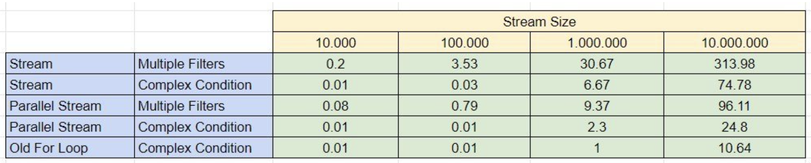

include::../../docs/asciidoc/settings.adoc[]

// local document variables
:func-prog-src_: ../src/main/java
:func-prog-test_: ../src/test/java
:package: funcprog

:toc:

== Functional Programming in Java

=== Preparation

._"Project Update" Details ..._
[%collapsible]
====
include::../../docs/asciidoc/includes/update-project.adoc[]
====

=== Theorie & Einführung

==== Lambda Ausdrücke

Funktionale Programmierung ist ein *Programmierparadigma*, in dem Funktionen im Mittelpunkt stehen, sie werden nicht nur definiert und angewendet, sondern auch wie Daten miteinander verknüpft, als Parameter verwendet und als Funktionsergebnisse genutzt.

Seit `Java 8` sind Elemente aus der funktionalen Programmierung in der Sprache enthalten. Ermöglicht werden sie durch die *Lambda-Ausdrücke*, sowie - wie bereits gesehen - die Streams.

Die einfachste Form eines Lambda Ausdruckes ist:

 parameter -> expression

Um mehr als einen Parameter zu nutzen, werden runde Klammern erforderlich:

 (parameter1, parameter2) -> expression

Weil die Ausdrücke limitiert sind und direkt einen Wert zurückgeben, kann auch ein Code-Block genutzt werden:

 (parameter1, parameter2) -> { code block }

Zu beachten ist, dass der `{ code block }` ein return statement enthalten muss.

Die Beispiele finden sich in

[subs="normal"]
 course-3/test/de/dhbw/{package}/FuncProgTest.java

z.B. für den Gebrauch in *Listen*:

[source,java,title="Lamdba Ausdrücke"]
----
include::{func-prog-test_}/de/dhbw/{package}/LambdaTests.java[tag="lambda-example-1"]
----

==== Streaming (API)

Zur verbesserten Verarbeitung von "Listen" in Java wurden spezielle Methoden durch "streaming" mit Java 8 eingeführt. Häufig wird der Begriff `filter-map-reduce` genutzt, um diese Möglichkeiten zusammenzufassen.

`Filter`

Bei der Anwendung mehrerer oder komplexer Filteroperationen sollte die Performanz beachtet werden. Hier eine Einschätzung:

.Performanz bei komplexen Filteroperationen

`Map`

_"Mapping"_ Operationen auf Listen transformieren diese. Methoden oder Klassen, deren Zweck die Abbildung von Klassen in andere Strukturen implementieren, werden häufig _"mapping"_ Methoden genannt, daher hier dieser Term hier ebenfalls genutzt.

Besonders die Veränderung der Datentypen der Listenelemente ist ein wichtiger Anwendungsfall beim Einsatz von `map(...)`.

`Reduce`

`Stream.reduce()` Operation reduzieren die Ausgangsdatenmenge. Dies erfolgt in Teilschritten:

* `Identity` – Ein Element mit einem initialen Wert für die Reduktionsoperation und der "default return value" wenn der Stream leer sein sollte.
* `Accumulator` – Eine Funktion mit zwei Parametern: ein Teilergebnis der Reduktionsoperation und das nächste Element des Streams.
* `Combiner` – Eine Funktion um die Teilergebnisse (der Reduktionsoperation) zu kombinieren wenn `reduce` parallelisiert wird.

Richtig nutzbringend ist oft erst die Kombination `filter`, `map` und `reduce` Operationen, um aus einfachen *Daten* am Ende *Informationen* zu gewinnen.

Dazu ein Beispiel:

[source,java,title="Beispiel einer reduce() Operation"]
----
include::{func-prog-test_}/de/dhbw/{package}/StreamingTests.java[tag="reduce-example1"]
----

Weitere Beispiele finden sich in

 course-3/test/de/dhbw/course3/streaming/StreamingTest.java

sowie zur Demonstration für einen *fachlichen* Nutzen, der "Erkenntnisse" aus den vorhandenen Daten ermittelt:

[source,java,title="Fachliches Beispiel (good code?, bad code?)", indent="0"]
----
include::{func-prog-test_}/de/dhbw/{package}/LambdaTests.java[tag="lambda-example-2"]
----

=== Demonstrationen

Die Unit-Tests zur *Demonstration* finden sich hier:

[subs=normal]
 src/[red]#*test*#/java/de/dhbw/{package}/FuncProgTests.java

Der zugehörige, in den Tests genutzte *Quellcode* findet sich hier:

[subs=normal]
 src/[red]#*main*#/java/de/dhbw/{package}/*.java

=== Übungen

Nutze folgende Testklasse für die Übungen:

[subs=normal]
 src/[red]#*test*#/de/dhbw/{package}/ExerciseTests.java

[[funcprog-exercise-1]]
*Übung 1:*

Implementiere eine Liste mit mehreren `boolean` Werten.

Nutze dann einen Lambda-Ausdruck, durch den die Listenelemente auf der Konsole ausgegeben werden können.

[[funcprog-exercise-2a]]
*Übung 2a:*

Implementiere den _"old fashioned way"_ für die Berechnung einer Summe:

[source, java, indent="0"]
----
include::../src/test/java/de/dhbw/funcprog/ExerciseTests.java[tags="old-fashioned-reduce"]
----

[[funcprog-exercise-2b]]
*Übung 2b:*

Implementiere die Übung 2a mit modernen Mitteln, d.h. ersetze die "alte" `for-each` Loop durch einen *Lambda*-Ausdruck:

[source, java, indent="0"]
----
include::../src/test/java/de/dhbw/funcprog/ExerciseTests.java[tags="modern-reduce"]
----

[[generics-exercise-3]]
*Übung 3:*

Für einen `Warenkorb` gilt es, darin enthaltene `Produkte` (mind. 3) zu nach ihrer `Produktkategorie` zu filtern.

_Optional: Ermittle den gesamten `Preis` des Warenkorbs als Summe der produkt-spezifischen Einzel-`Preise`._

Erstelle einen Unit-Test und (eine oder mehrere) Testmethoden für die Teilaufgaben.

=== Tipps, Patterns & Best Practices

*Predicates*

`Predicates` sollten, wenn möglich, _benannt_ werden, d.h. zum Beispiel anstelle von

 list.stream().filter(i -> i >= 10)

besser gekapselt in einer Methode oder mit einer Variable

 Predicate<Integer> isGreaterOrEqual10 = i -> i >= 10

oder

[source, java]
----
Predicate<Integer> isGreaterOrEqualTo(Integer number) {
   return i -> i >= number;
}
----

